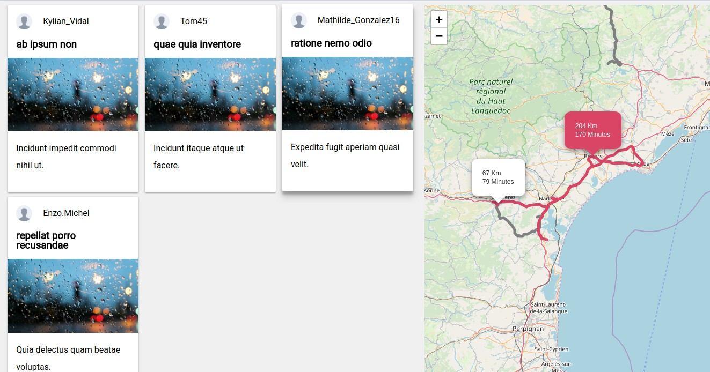

[Voir la démo](http://roadbook.websylvain.com) ou consulter le [repository github]()


# Prototyper un roadbook en JavaScript
Le but de cet exercice est d'afficher **des trajets sur une carte leaflet**. La difficulté est dans le fait qu'un itinéraire est la représentation d'un ensemble de données géographiques plutôt complexes (points de passage, distance, temps de parcours...).

Pour pouvoir afficher un trajet, il est nécessaire de connaître tous les points qui constituent le chemin. Plus on souhaite obtenir quelque chose de précis plus ses points de passage sont nombreux.

> Bah oue... une route n'est jamais droite, on rencontre de nombreux virages et croisements, il y a aussi des changements de direction. Il faut que votre ligne (le dessin sur la carte) épouse parfaitement les routes, autoroutes, chemins qui existent à l'heure actuelle.


## 1 / Obtenir les données géographiques d'un itinéraire entre plusieurs points

En effet, pour obtenir une route parfaite, nous sommes dans l'obligation de passer par ce que l'on appelle une **A.P.I** qui va se charger de calculer le tracé le plus réaliste possible entre les différents points choisis par l' utilisateur.

Il en existe un certain nombre dont voici une liste non exhaustive...

- [Directions par MAPBOX](https://www.mapbox.com/api-documentation/#directions)
- [Directions par MAPQUEST](https://developer.mapquest.com/documentation/directions-api/)
- [Directions par GOOGLE MAP](https://developers.google.com/maps/documentation/directions/start)
- [Route service par OSRM](http://project-osrm.org/docs/v5.15.2/api/#route-service)

Lorsque vous réalisez une requête (HTTP) à l'une de ces APIs, ces dernières vont vous retourner un json dans lequel vous obtiendrez vos données géographiques (le tracé, la distance à parcourir, le temps nécessaire pour réaliser le trajet etc...).

Selon l'API et les paramètres passés à la requête, vous pourrez obtenir les tracés d'un même itinéraire sous deux formes différentes:


1. Un **GéoJson**,  il s'agit d'un tableau dans lequel vous allez retrouver les coordonnées gps des points de passage de votre trajet.
2. Une **Polyline** est une forme géométrique encodée en chaîne de caractère.

::: tip Comment faire ?
Vous pouvez par exemple utiliser le client http [insomnia](https://insomnia.rest/) pour faire la requête et stocker le résultat dans une variable.
:::
#### Un trajet sous forme de geojson ( via Mapbox )

``` json
"routes": [{
    "geometry": {
      "coordinates": [
        [
          -73.98891,
          40.733122
        ],
        [
          -73.994118,
          40.735313
        ],
        [
          -73.996976,
          40.731414
        ],
        [...]
      ],
      "type": "LineString"
    },
    "legs": [...],
    "weight_name": "routability",
    "weight": 584.4,
    "duration": 382.6,
    "distance": 1317.9
  }
]
```

#### Un trajet sous forme de polyline (via OSRM)

``` json
"routes": [{
		"geometry": "uumfGawtOkKqJcB{AQOgD_D][kAcA{HsHsJqIcAsASw@Cg@Rc@VWpDw@HCLCz@QnBQ`J{ApB]x@K\\@^HZPR\\Jb@Bn@Ed@Q^MVSLUFYB]GOISSO_@OeAWaD[gDSw@g@{Gq@uIMcBa@{FSeDU}DUyFIiBG_BIeDIiDGeGCsEAwG?_NB{M?iLBcRBiZBy[ByN@cO@cLAgLEgECaEKyHO}FSyGY{Hc@gKUaGS_GEyBCuBC}DBsDHeFFiBJkCLaCVqDZmDd@mEj@_En@cEfAuGRoAtBgMx@wFp@aFn",
		"weight_name": "routability",
		"weight": 5302.2,
		"duration": 4769.9,
		"distance": 67124.9
	}
]
```


A vous de choisir l'api et le format qui vous conviennent le mieux...

## 2 / Leaflet, la carte
On ne présente jamais assez [Leaflet](https://leafletjs.com/) qui est à mon humble avis la meilleure librairie Javascript pour créer des cartes interactives et "mobile-friendly". Cette librairie est facile d'utilisation, performante, open source, documentée de la meilleure des manières et possède une très grande communauté d'utilisateurs.

Ces nombreux avantages en font la librairie que j'utilise le plus dès qu'il est question de projet avec une dimension S.I.G.

### Une classe facilite l'appel des fonctionnalités de Leaflet

Pour faire plus facilement appel aux différentes méthodes de leaflet, j'ai créé une classe qui va se charger de faire interface avec la librairie.

``` js
//Fichier LeafletMap.class.js

export default class LeafletMap {
  constructor () {
    this._map = null
    this._bounds = []
  }

  // Instancier une carte dans l'élément passé en paramètre
  load (element) {
    return new Promise((resolve, reject) => {
        // --> SET MAP
        this._map = L.map(element, {scrollWheelZoom:false})  // Pour avoir accès à l'objet map depuis les autres méthodes de la classe

        L.tileLayer('http://{s}.tile.openstreetmap.org/{z}/{x}/{y}.png', {
          attribution: 'Map data &copy; <a href="https://www.openstreetmap.org/">OpenStreetMap</a> contributors',
          scrollwheelzoom: false
        }).addTo(this._map)

        resolve()
        // END
    })
  }

  center () {
    this._map.fitBounds(this._bounds)
  }
}
```

Il ne me reste plus qu'à instancier un objet avec ma classe et faire appel à la méthode load de ce dernier pour afficher ma carte dans ma page html.

``` js
// Fichier app.js
import LeafletMap from 'LeafletMap.class.js'

var $divMap = document.getElementById('map')
const map = new LeafletMap()

map.load($divMap).then(() => {
  console.log('Tout est okay !')
})
```

### Afficher les trajets dans la carte
Nous voici au point culminant de notre exercice. Maintenant il va être question d'afficher les trajets dans la carte.

Pour cela, nous allons **ajouter une méthode dans la classe LeafletMap** qui va nous permettre de créer une **Polyligne** entre les différents points [lat, long] de notre trajet.

``` js
//Fichier LeafletMap.class.js

export default class LeafletMap {
  constructor () {...}

  // Instancier une carte dans l'élément passé en paramètre
  load (element) {...}

  center () {...}

  // Créer un trajet dans la carte, en dessinant une ligne entre différents points
  addRoad (coordinates) {
    this._bounds.push(coordinates)
    return L.polyline(coordinates, {color: 'grey'}).addTo(this._map)
  }
}
```

Maintenant, il ne vous suffit plus que de faire appel à cette méthode depuis le fichier app.js, tout en faisant passer en paramètre les coordonnées transmises par l'API. Dans l'exemple il s'agissait de la propriété **geometry** présente dans réponse de l'API.


Selon que l'api vous envoie une polyline ou un tableau de coordonnées, on ne va pas pouvoir utiliser cette méthode de la même manières. Voilà comment je procède:

#### Si nous avons un GeoJson
Là il suffit de récupérer le tableau des cordonnées gps représentant les points de passage et le placer en paramètre de notre méthode map.addRoad();

``` js
// Fichier app.js
import LeafletMap from 'LeafletMap.class.js'

const maRoute = [...] // <-- La réponse de l'API est stockée ici

var $divMap = document.getElementById('map')
const map = new LeafletMap()

map.load($divMap).then(() => {
  map.addRoad(maRoute[0].geometry)
  console.log('Tout est okay !')

  map.center()
})
```

#### Si nous avons une polyline
Dans le cas ou vous avez une polyline, vous allez devoir convertir la chaine de caractère **en coordonnées Gps**. C'est là que j'ai découvert un module de Mapbox qui permet d'encoder ou de décoder des cordonnées. Rendez vous sur le [repository de Mapbox](https://github.com/mapbox/polyline/) pour pouvoir la rajouter dans vos dépendances.

```
$ npm install @mapbox/polyline --save
```

``` js
// Fichier app.js
import LeafletMap from 'LeafletMap.class.js'
import polyline from '@mapbox/polyline'

const maRoute = [...] // <-- La réponse de l'API est stockée ici

var $divMap = document.getElementById('map')
const map = new LeafletMap()

map.load($divMap).then(() => {
  map.addRoad(polyline.decode(maRoute[0].geometry))
  console.log('Tout est okay !')
})
```

ET VOILA votre route devrait s'afficher dans votre carte !


::: warning Quand un trajet en voiture dans le sud de la France se transforme en safari Africain.
:lion: Certaines librairies et api n'ont pas le même système de projection ni même la même façon de formaliser les coordonnées gps.

Certaines comme Leaflet sont de la forme suivante [lat, long] et d'autres comme Mapbox sont comme ça [long, lat]. Cet [article de Mac wright](https://macwright.org/lonlat/) recense les différentes librairies et leurs formats de coordonnées GPS respectifs.
:::
