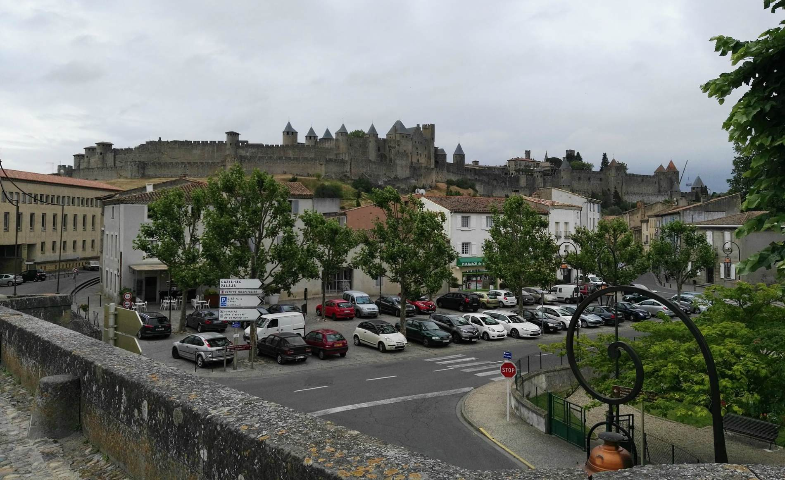

Après plusieurs années à apprendre et vivre la vie Toulousaine, j'ai opté pour du changement ! C'est suite à la lecture d'un grand classique en développement personnel que cette décision a sonné comme une évidence pour moi.

> « Ecoute ton coeur. Il connaît toute chose, parce qu’il vient de l’Âme du Monde, et qu’un jour il y retournera. » L'Alchimiste de Paulo Coelho.

Je me suis donc demandé ce que j'avais réellement envie de faire et ce n'était certainement pas de rester 8 heures dans le même bureau, n'attendant que de débaucher pour travailler sur des projets plus palpitants. J'ai envie d'être pleinement dans l'action, d'appartenir à quelque chose de plus grand; de pouvoir m'investir dans des projets passionnants et donner l'envie à mon entourage de connaitre ma passion et mon travail.

Aujourd'hui c'est décidé, je donne cette lettre de démission à mon patron... et je me lance !

## Carcassonne, mon terrain de jeu
Pour moi les grandes villes de l'Aude comme Narbonne et Carcassonne **ont un potentiel grandissant** dans le domaine de l'entreprenariat. En témoigne les différents collectifs, pépinière, espace de coworking [etc] qui naisse dans le département. Je me suis rendu compte, notamment, que l'Aude était en train de parcourir une belle ascension dans ce domaine dont le monopole était jusqu'à lors détenu par les grandes villes de France comme Toulouse.

En cherchant quelques points chaud de l'entreprenariat dans l'Aude, je suis tombé sur une page dédié à ce sujet [sur le site de l'agglo](https://entreprendre.carcassonne-agglo.fr/fr/innovation/les-poles-strategiques.html). Pour networker et rencontrer les entrepreneur Audois, je me rendrai sur les différents événements liés à l'innovation, la création de business et le digital dès que l'occasion se présentera

### Des pépinières, incubateurs et des espaces de coworking
Comment parler d'entrepreneuriat dans le département Audois sans mentionner les épicentres de ce mouvement:

[Pépinière Innovéum](http://www.pepiniere-innoveum.org)
  ---> le grand Narbonne

[Creaude_Startup](http://www.creaude.com/)
  ---> Carcassonne et Castelnaudary

### De l'accompagnement, Aide, formation

A côté des agences digitale vers lequel les entreprises se tourne naturellement pour des prestations, d’autres acteurs se spécialisent dans l’accompagnement et la digitalisation des entreprises.

Exemple: https://www.labulleweb.com/

Le grand Narbonne à récemment lancé **IN’ESS**, une équipe dont l’objectif est d’ orienter au mieux les nouveaux porteurs de projet. Mais ce n’est pas tout, la Communauté d’agglomération s’est doté d’une formation permettant d’apprendre à créer et diriger des projets numériques. Le but étant ainsi de préparer les jeunes à se tourner vers des postes de chef de projet, de lancer leurs entreprises.

http://entreprendre.legrandnarbonne.com/71-actualites/14695-le-grand-narbonne-et-liut-de-beziers-lancent-la-premiere-formation-createur-entrepreneur-numerique.html

## Nom de diou, ça motive!
Bien sur le paysage de l'entrepreneuriat et des startups Audoises ne se résume pas seulement à ces quelques références, mais je pense que connaître ces quelques points stratégiques va me permet de me lancer dans cette aventure avec plus de motivation que jamais !
