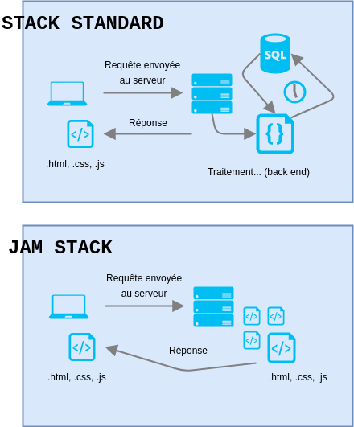
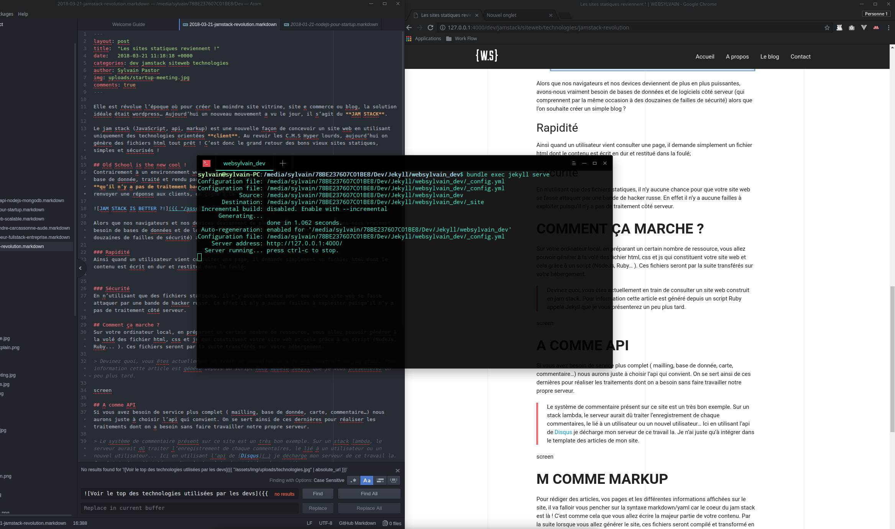

Elle est révolue l’époque où pour créer le moindre site vitrine, site e commerce ou blog, la solution idéale était wordpress… Aujourd’hui un nouveau mouvement a vu le jour, il s’agit du **JAM STACK**.

Le jam stack (JavaScript, api, markup) est une nouvelle façon de concevoir un site web en utilisant uniquement des technologies orientées **client**. Au revoir les C.M.S Hyper lourds, aujourd’hui on génère des fichiers html tout prêt ! C’est donc le grand retour des bons vieux sites statiques, simples et sécurisés !

## Old School is the new cool !
Contrairement à un environnement web lambda où pour chaque requête le contenu est récupéré depuis une base de donnée, traité et rendu par la suite à l’utilisateur, le JAM STACK se base sur le fait **qu’il n’y a pas de traitement backend à réaliser**. En supprimant toutes ses étapes avant de renvoyer une réponse aux clients, on gagne à la fois en simplicité, en rapidité et en sécurité.

### Rapidité

Alors que nos navigateurs et nos devices deviennent de plus en plus puissantes, avons-nous vraiment besoin de bases de données et de logiciels côté serveur (qui comprennent par la même occasion des failles de sécurité) alors que l’on souhaite créer un simple blog ?  

Ainsi quand un utilisateur vient consulter une page, il demande simplement un fichier html dont le contenu est écrit en dur et restitué dans la foulé;

### Sécurité
En n’utilisant que des fichiers statiques, il n’y aucune chance pour que votre site web se fasse attaquer par une bande de hacker russe. En effet il n’y a aucune failles à exploiter puisqu’il n’y a pas de traitement côté serveur.

## Comment ça marche ?
Sur votre ordinateur local, en préparant un certain nombre de ressource, vous allez pouvoir générer à la volé des fichier html, css et js qui constituent votre site web et cela grâce à un script (NodeJs, Ruby... ). Ces fichiers seront par la suite transférés sur votre hébergement.

> Devinez quoi, vous êtes actuellement en train de consulter un site web construit en jam stack. Pour information ce dernier est généré grâce à une gem Ruby appelé **Jekyll**.

## A comme API
Si vous avez besoin de service plus complet ( mailling, base de donnée, carte, commentaire…) nous aurons juste à choisir l’api qui convient. On se sert ainsi de ces dernières pour réaliser les traitements dont on a besoin sans faire travailler notre propre serveur.

> Le système de commentaire présent sur ce site est un très bon exemple. Sur un stack lambda, le serveur aurait dû traiter l’enregistrement de chaque commentaires, le lié à un utilisateur ou un nouvel utilisateur... Ici en utilisant l’api de [Disqus](https://disqus.com/) je décharge mon serveur de ce travail la. Je n’ai juste qu'à intégrer dans le template des articles de mon site.

## M comme markup
Pour rédiger des articles, vos pages et les différentes informations affichées sur le site, il va falloir vous pencher sur la syntaxe markdown/yaml car le coeur du jam stack est là ! C’est comme cela que vous allez écrire la majeur partie de votre contenu. Par la suite lorsque vous allez générer le site, ces fichiers seront compilé et transformé en html.

## Les limites
Vous l’aurez compris le Jam stack voit très vite ses limites lorsqu’il est question de déployer une plateforme web ou un site web ayant des services particuliers et innovant. Mais la mise en place de cette méthode, sera répondre parfaitement à vos besoins si mettre en avant du contenu est votre principal objectif.

sources: [jamstack.com](http://jamstack.com), [jamstatic.fr](http://jamstatic.fr)
