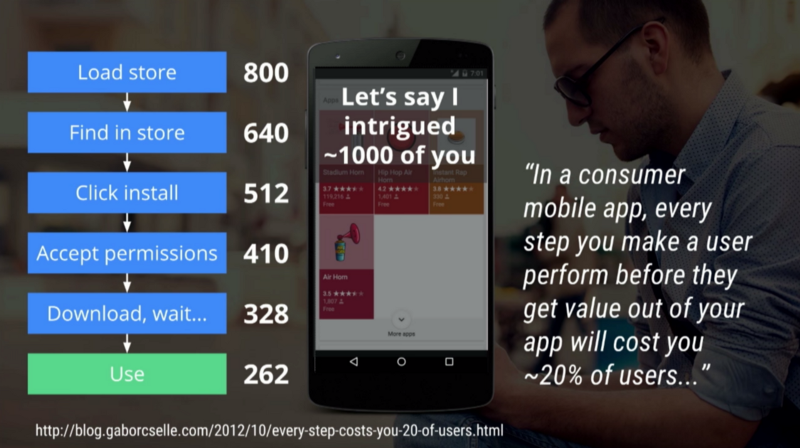

Le constat actuel du marché mobile est le suivant; nous avons d'un coté les applications natives codées directement pour Android/IOS/PC... et de l'autre, les applications hybrides dont le principe est de convertir à postierori du code html en natif. MAIS face à l’évolution des navigateurs et des habitudes d’utilisation, le géant google nous propose un nouveau concept bien plus performant !

## Progressives web app, la définition

Ce terme a été introduit par Alex Russel (Développeur Chrome) et désigne un site web qui s’adapte en plusieurs points aux différents terminaux. Plus qu’un simple site responsive, ces derniers s’adaptent par exemple aux technologies présentes et la force du signal wifi/3G/4G/5G…

Le but de ces web apps est de proposer une expérience d’application native directement a travers le navigateur de votre smartphone, tablette...

## Les avantages des applications natives et les avantages du web

Contrairement à votre site web, l’application native de votre concurrent a de nombreux avantages:

* Une icone bien visible qui invite l’utilisateurs
* Des notifications qui permettent de faire revenir votre utilisateur sur l’application
* Application qui s’ouvre même hors ligne.

> Ainsi les applications natives on l’avantage de se rappeler à l’utilisateur et de l’inviter à l’utilisation. Et votre site web il est où dans tout ça ? Bahhh votre site il est caché derrière l’icone du navigateur !

### Mais les applications natives/hybrides on un gros défaut !
Le nombre des utilisateurs diminue tout au long du parcours qui leur permet d’obtenir l’application !

via: [Article Medium de Dan Dascalescu](https://medium.com/dev-channel/why-progressive-web-apps-vs-native-is-the-wrong-question-to-ask-fb8555addcbb)

### Progressive web apps =  Les avantages du web + les avantages des applications mobiles !
On sait aujourd’hui qu'un site web possède de nombreux avantages par rapport à l’application notamment du point de vue reach mais aussi de l’engagement des prospects.

Imaginons maintenant qu’un site ouvert sur smartphone possède les avantages d’une application mobile:

> Votre site sera rapide, l’utilisateur pourra l’ajouter facilement à la page d’accueil, il enverra des notifications (actualités, messages...) à ce dernier pour lui rappeler sa présence et l'inviter à retourner dessus.

Lorsque l'utilisateur n'a pas de réseau (Wifi, 3G, 4G...), votre progressive web app **ne vous affichera pas le dinosaure (tellement redouté) de google**. La navigation restera possible avec les contenus déjà chargé par l'utilisateur durant une précédente visite sur votre webapp. Cela est permis grâce à un système de cache intélligent enregistrant les données importantes pour qu'elles soient accessibles à tout moment même en mode avion.

## Dans la pratique

ATTENTION, en réalité “Progressive web apps” c’est un terme marketing. **Il ne s’agit pas d’un nouveau canal de distribution ou quoique ce soit d’autre**.  C’est tout simplement votre site web mobile auquel on ajoute les fonctionnalités souhaités ( rapidité, ajout à l’accueil, notifications…).

La logique *progressive* se veut être la suivante: plus un mobinaute a de possibilité d’usage ( via la technologie embarqué par sa divice, l’état du réseau... ), plus le site web déploie ses ailes !

### Exemples de progressives web apps

Voilà l’exemple de l’appli “Pokemon” de google, présentant l’ajout d’un site web progressif à l’écran d’accueil.

via: [developers.google.com](https://developers.google.com/web/updates/2015/12/getting-started-pwa)

1. On va sur le site via le navigateur.
2. On clique sur le bouton “ajouter à l’écran d’accueil du mobile”, action qui prend environ 1 sec.
3. En cliquant sur l’icone, nous avons droit ainsi à “Splash screen” qui occupe l’écran pendant le chargement du site web.
4. Le site s’affiche sans l’entête du navigateur etc...  **L’illusion est faite votre site passe ainsi pour une vrai application ! :D**

## L'exemple concret de ALI EXPRESS
Ali express est un site de commerce en ligne du Groupe Alibaba spécialisé dans la vente de produits à prix de gros, aux particuliers et à l'international. Aujourd'hui ce groupe a choisi de ce tourner vers les progressives web apps pour faire évoluer son business. Voilà une petite vidéo qui présente sa nouvelle version du site web:

Lors d'une visite sur leurs site, une banière vous propose d'ajouter leur site web à l'écran d'accueil de votre smartphone, ainsi vous aurez la possibilité de recevoir les notifications qui concernent votre compte. De plus, comme vous pouvez le voir, lorsque l'on retourne sur le site depuis l'icone, aucune en tête et pied de page de votre navigateur web n'est visible ! L'illusion est parfaite :) !

<iframe width="100%" height="315" src="https://www.youtube.com/embed/lzQhw_wbr7c" frameborder="0" allowfullscreen></iframe>

## Des règles à respecter !

**Progressive & Responsive**: doit s’adapter à la taille de l’écran mais aussi aux technologies embarquées par l’utilisateur.

**Connectivity independant**: contrairement à un simple site web; si le smartphone n'est pas connecté au wifi ou au réseau 3G, 4G [...], les contenus ayant été consultés lors d'une précédente visite sont toujours accessibles.

**Easily installable**: installation simplifiée grâce à un simple click pour l’ajouter à l’écran d’accueil.

**App Like**: cohérence graphique avec les app mobiles.

**Safe**: sécurité via https.

**Fresh**: toujours à jour.

**Linkable & discoverable**: la force du web, c’est que l’on peut accéder à une des pages de l’app grâce à un simple lien.

**Benefit From Native Features**: notifications, raccourci widget sur smatphone...

**Manifest**: le manifest est un document placé à la racine de votre site web permettant à google et au navigateur de comprendre qu’il s'agisse bien d’une web app.

## Impact sur le business
Ce qui nous intéresse, c’est bien la rentabilité apportée par un tel produit. Pour vous convaincre, voyons à travers le site de Ali express et les [données que nous fournissent Google](https://developers.google.com/web/showcase/2016/pdfs/aliexpress.pdf), quel est la probable évolution de votre site web:

* 2x plus de pages consultés
* Augmentation de 74 % du temps passé sur le site
* 104 % de conversion supplémentaire

> Alors convaincu ?
