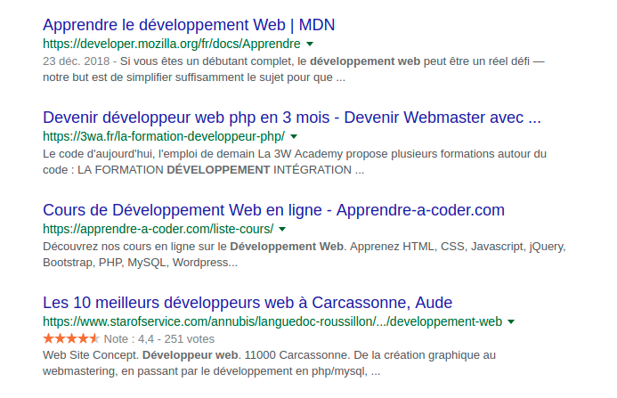

Lorsqu' il est question de créer une **S.P.A** (single page application), une problématique revient très souvent... A savoir; le S.E.O *(référencement naturel)*. En effet, cette dimension du projet constitue un des piliers principaux du tunnel de conversion.

## Pourquoi entre SEO et les SPA, c'est pas le grand amour ?
Une des règles d'or en S.E.O c'est d'avoir le contenu de la balise **title** différents pour chacune des pages de notre site web. Il y a aussi les balises **meta** qui permettent de donner des informations supplémentaires aux moteurs de recherches et au protocole OpenGraph des reseaux sociaux.



Hors toutes le respect de ces règles devient acrobatique lorsque l'on développe une S.P.A avec un framework JavaScript.

Pour illustrer cela prenons l'exemple du framework [Vuejs](https://vuejs.org/). Avec ce derniers, la parti concernée par la reactivité du framework ce situe dans le **body** ce qui empêche toute la partie se situant dans la balise **head** d’être modifiée dynamiquement, hors c'est la que ce situe les balises meta et title.


Plusieurs parades sont possible pour pouvoir tenir à jour vos balises title/metas côté front end.

## Solution numéro uno : [Vue-Meta](https://github.com/declandewet/vue-meta)

Il s’agit d'un plugin Vue.js très pratique permettant de modifier directement les metas informations de votre app. Cela se fait via une nouvelle propriété **"metaInfo"** depuis l'instance de vue.js ou depuis un composant.

### Installation

Pour l'installer, rien de plus simple, il suffit de taper la commande qui va bien:

```sh
$ npm install vue-meta --save
```

Et dire à vue d'utiliser le plugin dans le **main.js**

```js{4,6}
import Vue from 'vue'
import App from './App.vue'
import router from './router'
import Meta from 'vue-meta';

Vue.use(Meta);

new Vue({
  router,
  render: h => h(App)
}).$mount('#app')
```


### Utilisation basique
En renseignant les informations renseigne **depuis app.vue**, vous vous assurez que celles ci seront renseignées par défaut sur toutes les routes de votre application.

Vous pouvez aussi renseigner une mise en forme commune pour vos balises title. Admettons vous souhaitez que vos titre de page respectent la forme suivante "Nom de la page - Ma super application vue.js", il faudra donc renseigner ce titleTemplate dans app.vue de la maniere suivante.

*app.vue*
```vue{12,16}
<template>
  <div id="app">
    <router-view></router-view>
  </div>
</template>

<script>
  export default {
    name: 'App',
    metaInfo: {
      // Nous définissons ici le titre par défaut de notre app
      title: 'Titre par défaut',
      meta: [
        { vmid: 'description', name: 'description', content: 'Ma superbe description par défaut'}
      ],
      titleTemplate: '%s | Ma super application vue.js'
    }
  }
</script>
```

*about.vue*
```vue{11}
<template>
  <div id="page">
    <h1>About Page</h1>
  </div>
</template>

<script>
  export default {
    name: 'About',
    metaInfo: {
      title: 'A propos',
      meta: [
        {
          vmid: 'description', name: 'description',
          content: 'Ma superbe description pour la route /about'
        }
      ]
    }
  }
</script>
```

Resultat:
> la balise title de la route / -> *"Titre par défaut - Ma super application vue.js"*.

> la balise title de la route /about -> *"A propos - Ma super application vue.js"*.

### Des metas informations basées sur des actions et computed asynchrones
Imaginons maintenant que vous avec un système de blog. Lorsque vous cliquez sur un article vous êtes envoyé vers la route /post (composant post.vue). Les données de cet article sont récupérées grâce à un appel api et servies par la suite à notre *template*. Vous ne pouvez pas transmettre le résultat aussi facilement à metaInfo. En effet, la variable ou propriété calculée qui contient les données vaudra en premier lieu *undefined* et générera donc une erreur.

Pour pouvoir faire cela, la [documentation](https://github.com/declandewet/vue-meta#how-do-i-populate-metainfo-from-the-result-of-an-asynchronous-action) nous conseille de procéder autrement en utilisant la forme fonctionnelle de metaInfo. Ainsi les informations se mettrons à jour en même temps que le state de notre composant.

```js{19,21}
import store from '@/store/store'
export default {
  store,
  data() {
    return {
      loading: true
    }
  },
  mounted() {
    this.$store.dispatch('posts/loadCurrent', this.$route.params.id).then(() => {
      this.loading = false
    });
  },
  computed:{
    post() {
      return this.$store.getters['posts/getCurrent']
    }
  },
  metaInfo() { // ici metaInfo est une fonction !
    return {
      title: this.loading ? 'Loading...' : this.post.title,
      meta: [
        { vmid: 'description', name: 'description', content: this.loading ? 'Loading...' : this.post.excerpt}
      ]
    }
  }
}
```

## SEO Vue.js sans module

Il est possible aussi de se brancher sur une des fonctions incontournable de **vue-router** pour modifier nativement les balises titles: **beforeEach**. Nous n'avons qu’à renseigner une propriété que j'appelle arbitrairement *meta* dans chaque composant (nos views) et l'utiliser ensuite dans le router.

*about.vue*
```vue{11}
<template>
  <div id="page">
    <h1>About Page</h1>
  </div>
</template>

<script>
  export default {
    name: 'About',
    meta: {
      title: 'A propos',
    }
  }
</script>
```

*router.js*
```js
router.beforeEach((to, from, next) => {
  document.title = to.meta.title
})
```

Voilà ! Je vous souhaite une bonne continuation et n’hésitez pas à poster ici vos tips pour un bon référencement naturel avec Vuejs !
