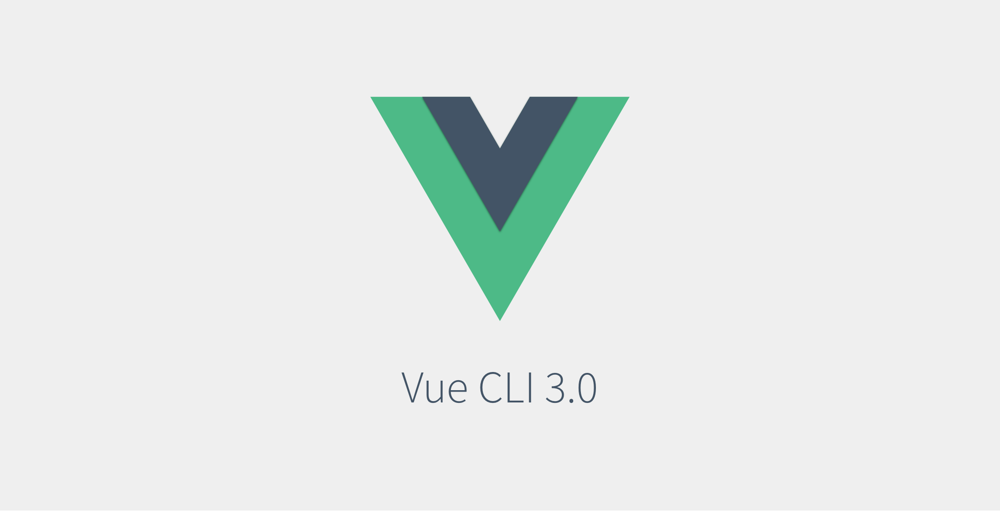

[Voir la documentation officielle](https://cli.vuejs.org/)

Traduction de l'[article paru dans naturaily.com](https://naturaily.com/blog/pwa-vue-cli-3) le 6 aout 2018

Dans un article précédent à propos de Vue CLI 3.0 j'ai mentionner que le support du plugin PWA était a mon avis une des meilleures fonctionnalités. Dans ce post, j'aimerais vous introduire au monde de la **PWA en utilisant Vue CLI 3.0**.

## Avant toute chose, qu'est que le PWA ?

[Progressive Web App](https://websylvain.com/posts/progressive-web-apps.html) est un concept qui améliore l'expérience utilisateur dans les applications web, en les rendant fiables, rapides et accueillantes, selon la description de Google Developper.Lors de Goofle I/O « 17 à propos de la présentation des PWA, il a été mentionner que dans le top 1000 des apps mobiles contre le top 1000 des web mobiles caractéristiques, les mobiles wev ont 3 fois plus de visiteurs uniques que les apps natives, mais ce qui est plus intéressant sont les statiques à propos du temps moyen passer dessus.

Les utilisateurs d'apps Natives y passent plus de 20 fois plus de temps que les utilisateurs de web mobiles ! cette statistique est écrasante ! mais il y a une explication a ça ! les Apps natives son t plus accueillantes que les pages web. il est bien plus facile de juste taper sur une icône sur son écran d'accueil que le taper une longue URL. les app Natives son aussi conçu pour les mobiles, que ce soit en termes de design graphique, de caractéristiques et du point de vue technique. Contrairement au web apps, les app natives ont des notifications push, accès a votre caméra, votre micro, mais est que c'est toujours vrai ? Non ! PWA peut faire ça aussi !

## Les caractéristiques des PWA

PWA est une stratégie orientée mobile de création d'application web, voici comment Google décrit sur son site les 3 caractéristiques clés des PWA :

- fiables,
- rapides,
- Accueillantes,
  mais qu'est ce que ça signifie vraiment pour l'utilisateur ?

Selon moi, ça signifie :

- accessible hors ligne - pour fournir de la fiabilité
- rapide sur dans toutes les conditions de réseau et n'importe quel appareil,
- installable sur votre écran d'accueil - pour être accueillant

Vous pourrez trouver dans lighthoiuse et la section checkliste et tout au long de l'article d'autres caractéristiques.

## PWA dans Vue — premier contact

Vue CLI 3.0 introduit une structure de plugin d'application, merci, car grâce a ça vous pouvez facilement ajouter le plugin PWA a vos app quand vous le voulez.

Pour ajouter le plugin PWA a un projet d'app Vue CLI 3.0 existants, tapez simplement dans votre console :

```bash
vue add @vue/pwa
```

Vue CLI genetators vas créer tous les fichiers nécessaires pour faire votre app PWA ready.

quand depuis le début vous savez que vous avez besoin de PWA dans votre nouvelle app vous pouvez utiliser

```bash
vue create <app-name>
```

et simplement choisir dans le configurateur l'option 'PWA support'

Quand vous avez installé votre plugin ou créé votre app, vous trouverez dans l'arbre de votre app 3 fichiers qui sont cruciaux dans les app PWA.

ces fichiers sont :

- manifest.json
- registerServiceWorker.js
- et quelques autres moins intéressants.

Je les décrirais plus en détail les plus importantes dans les prochaines sections de cet article.

## Rendez votre web app installable

Une de manière de rendre votre app plus accueillante est de la rendre installable. Grâce à ça les utilisateurs peuvent avoir un accès facile a votre site juste d'en simple tap sur l'icône de leur écran d'accueil, ce qui est beaucoup plus rapide et facile que de taper une URL entière. Pour rendre cela possible, vous avez juste à créer et/ou remplir le fichier manifest. Les manifest fournis les informations cruciales à propos de votre application, comme les noms de l'app, une icône a affiché sur l'écran ou plus. Vous pouvez trouver la liste entière des réglages dans la documentation officielle [MDN web doc](https://developer.mozilla.org/en-US/docs/Web/Manifest).

Vue CLI 3.0 et le plugin PWA vont créer un fichier manifest.json par défaut pour vous, mais rappelez-vous de le personnaliser pour vos besoins ! voici a a quoi ressemble le fichier manifest.json par défaut (le fichier est situé dans le dossier /public) :

```json
{
  "name" : "pwa",
  "short_name" : "pwa",
  "icons" : [
    {
      "src" : "/img/icons/android-chrome-192x192.png",
      "sizes" : "192x192",
      "type" : "image/png"
    },
    {
      "src": "/img/icons/android-chrome-512x512.png",
      "sizes": "512x512",
      "type": "image/png"
    }
  ],
  "start_url" : "/index.html", "display" : "standalone","background_color" : "# 000000",
  "theme_color" : "#4DBA87"
}
```

Le template PWA va aussi générer un ensemble d'icônes qui seront utilisées pour représenter votre app sur les mobiles. Imo, est une bonne référence de la taille de ce que vous devriez utiliser pour que votre app soit jolie sur un écran d'accueil.

manifest.json n'est pas le seul endroit ou vous pouvez jeter un œil pour rendre votre app installable. Quelques autres réglages peuvent être effectués depuis le fichier vue.config.js, vous pouvez y changer des caractéristiques comme la couleur du thème, la couleur MS Tile, ou indiquer que votre app ne supporte pas les appareils Apple avant iOS 11.3 (vous pouvez lire plus à propos du support des PWA sur les appareils Apple dans la section appareils Apple).

Pour une liste complète des réglages que vous pouvez faire dans le fichier vue.config.js et des exemples, jetez un œil [ici](https://www.npmjs.com/package/@vue/cli-plugin-pwa/v/3.0.0-rc.1) :

## Les Services Workers

Service Workers est un script qui tourne en arrière-plan et qui permet a votre app de fonctioner en ligne, mais aussi hors ligne, ce qui est une des caractéristiques des PWA.

La principale caractéristique des services workers utiliser dans les PWA et leur capacité a intercepté et gérer les requêtes serveur qui d'habitude sont faites en utilisant le cache, mais merci aux services workers, car vous pouvez faire bien plus que mettre en cacher vos requêtes réseau. en utilisant les services workers vous pouvez aussi faire des synchronisations en arrière plan et des notifications push.

Pour faire fonctionner vos 'Services Workers' aujourd'hui, il y a deux prérequis :

### 1. prise en charge du Navigateur

Pendant très longtemps, le problème crucial avec les 'service workers' était un manque de soutien de tous les navigateurs. Aujourd'hui, la situation
parait plus optimiste et la plupart des navigateurs prennent en charge les SW. vous pouvez trouver plus de détails sur la page de Jake Archibald.

### 2. HTTPS

Les Services Workers sont une chose très puissante.il peut fabriquer et filtrer vos data ou détourner des connexions. C'est pour ça que l'HTTPS est si important.

si vous voulez en lire plus sur les Services Worker, je vous recommande de vous regarder de façon plus approfondie [ici](https://developers.google.com/web/fundamentals/primers/service-workers/)

## Que devont nous mettre en cache et comment ?

> Il y a seulement deux choses de difficiles dans les sciences informatiques :
la validation des caches et nommer les choses
>
> ~ Phil Karlton

Pour que votre app fonctionne hors ligne, il est important de mettre en cache les fichiers appropriés et les ressources d'une manière appropriée. dans les cas d'application web, ça sera le plus souvent :

- les principaux Javascripts de l'app et les fichiers CSS
- les fonts
- les images
- les requêtes HTTP cruciales

il n'y a pas de règle universelle sur ce que vous devez mettre en cache dans votre application, donc la décision finale vous devez la faire selon ce qui est le meilleur pour votre application

Il y a une décision que vous devez prendre dans ce cas : comment aller vous mettre en cache ces fichiers.

Vue CLI 3.0 utilise sous le capot **workbox** pour faire fonctionner les services workers, voici quelques stratégies disponibles :

- cacheFirst

  - correspond le mieux : Fonts, Images

- networkFirst

  - correspond le mieux : requêtes réseau

- staleWhileRevalidate
  - correspond le mieux : pour les fichiers JS et CSS qui ne sont pas précacher


Voici a quoi cela peu ressembler dans les fichiers Vue Service Worker, le code Service Worker est assez explicite :

```js
workbox.setConfig({
  debug: false
});

workbox.precaching.precacheAndRoute([]);

workbox.routing.registerRoute(
  /\.(?:png|gif|jpg|jpeg|svg)$/,
  workbox.strategies.staleWhileRevalidate({
    cacheName: "images",
    plugins: [
      new workbox.expiration.Plugin({
        maxEntries: 60,
        maxAgeSeconds: 30 * 24 * 60 * 60 // 30 jours
      })
    ]
  })
);

workbox.routing.registerRoute(
  new RegExp("https://some-fancy-api.com"),
  workbox.strategies.networkFirst({
    cacheName: "api"
  })
);

workbox.routing.registerRoute(
  new RegExp("https://fonts.(?:googleapis|gstatic).com/(.*)"),
  workbox.strategies.cacheFirst({
    cacheName: "googleapis",
    plugins: [
      new workbox.expiration.Plugin({
        maxEntries: 30
      })
    ]
  })
);
```

Rappelez-vous d'enregistrer vos services worker dans votre app. Vue CLI a créer le fichier **registerServiceWorker** pour vous, et voilà a quoi il ressemble :

```js
import { register } from "register-service-worker";

if (process.env.NODE_ENV === "production") {
  register(`${process.env.BASE_URL}service-worker.js`, {
    ready() {
      console.log(
        "App is being served from cache by a service worker.\n" +
          "For more details, visit https://goo.gl/AFskqB"
      );
    },
    cached() {
      console.log("Content has been cached for offline use.");
    },
    updated() {
      console.log("New content is available; please refresh.");
    },
    offline() {
      console.log(
        "No internet connection found. App is running in offline mode."
      );
    },
    error(error) {
      console.error("Error during service worker registration:", error);
    }
  });
}
```

NOTE : rappeler vous de donner le même nom au fichier service worker que ceux dans registerServiceWorker. Dans ce cas service-worker.js.

pour plus d'information sur l'utilisation de workbox jeter un œil [ici](https://developers.google.com/web/tools/workbox/)

## Accès hardware

Un des plus grands avantages des apps mobiles native est l'accessibilité aux caractéristiques hardware comme la camera, la géolocalisation, Bluetooth, etc., mais de nos jours même les applications web peuvent avoir accès a beaucoup de caractéristiques de vos mobiles ou ordinateur portables. Bien sûr, beaucoup dépendent de votre navigateur, et les apps mobiles natives continuent d'avoir un meilleur accès, mais les web apps n'ont pas de quoi avoir honte.

Si vous êtes intéressé par ce que le web peut faire aujourd'hui vous devriez visiter ce [lien](https://whatwebcando.today/)

Je vais passer la manière dont on implémente accès a la camera ou au Bluetooth dans votre app Vue, parce que ce n'est pas le propos de cet article et le web est plein de ressources mieux écrites sur comment utiliser ses caractéristiques natives.

## PWA sur les appareils Apple

PWA est une technologie largement supporter par google, c'est grâce à ça quelle fonctionne sur tous les appareils Android, mais c'est légèrement plus problématique sur les appareils iOS.

Apple a déjà montré la prise en charge des PWA sur les appareils iOS, donc ce n'est qu'une question de temps. Ils ont cependant beaucoup de travail devant eux pour être aussi bons que Google dans ce domaine.

La version iOS 11.3 est une lueur d'espoir pour les PWA. cette mise a jour arrive avec la prise en charge des caractéristiques fondamentales des PWA sur les appareils mobiles Apple, comme les services workers et les fichiers manifest de l'app.

Même avec ça, développer une app pour un appareil Apple demande beaucoup plus de concentration de la part du développeur qu'il est nécessaire pour une app Android. il reste des problèmes avec l'écran de démarrage, les boutons de l'écran d'accueil, la navigation, la persistance des données, etc.

certain de ces problèmes on été hacker par netguru développeurs, vous pouvez lire plus a ce propos [ici](https://www.netguru.co/codestories/few-tips-that-will-make-your-pwa-on-ios-feel-like-native)

Générer un écran de démarrage est beaucoup plus facile avec l'outil Appscope.

## Lighthouse et la liste PWA

PWA est soutenu par Google, ils ont sorti des outils et des notes, qui pourraient vous aider à écrire votre PWA parfaite.

Lighthouse est un plugin inclus dans Chrome qui vous permet de faire un audit de votre application selon différents angles, l'un d'eux est aussi la PWA. l'audit Lighthouse des PWA va automatiquement vérifié pour vous les caractéristiques telles que :

- l'enregistrement des services worker,
- la configuration de l'écran de démarrage,
- la réponse du site hors ligne,
- la présence de l'HTTPS,
- la vitesse en connexion 3G,
- et beaucoup d'autres

L'audit PWA Lighthouse vérifiera seulement les parties requises par la liste de base des PWA, mais même s'il y a des choses que vous devrez vérifier manuellement comme : que fonctionnement avec différents navigateurs, que chaque page a une URL ou que les transitions de page ne donnent pas l'impression d'être bloqué par la connexion réseau.

## Conclusion

Les PWA ont encore un long chemin à faire, mais c'est sur de très bons rails !

j'espère qu'Apple va bientôt prendre en charge complètement les PWA parce que ça aiderait les PWA à devenir bien plus une technologie populaire. Merci a Vue CLI 3.0, car faire des apps PWA est de la tarte, et merci a la structure en plugin qui vous permet de facilement inclure les PWA dans vos projets a n'importe quel moment du développement.

Tout ce dont vous avez besoin de vous préoccuper c'est de préparer les graphismes et prendre les décisions sur ce que vous voulez mettre en cache, le plugin PWA Vue fera le sale boulot pour vous.
